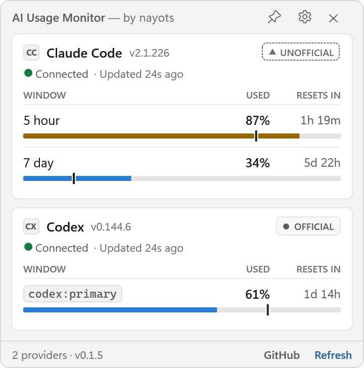

<!--
  Two variants rather than one, because the wordmark's ice-to-gold gradient is only legible on
  deep navy: on GitHub's light theme the white middle of it would disappear. The transparent
  master serves dark theme, the plated master serves light. Neither is resized here - the
  lettering is 48px tall in both, and the plated file is taller only because it carries the
  brand's required clear space. Masters copied verbatim from the nayots branding repository;
  do not recolour, crop or rename them.

  Deliberately NOT wrapped in a link to nayots.com. GitHub's HTML sanitizer lifts an  out
  of any surrounding anchor and re-links it to the image file, and in doing so it lifts the img
  out of the <picture> too - leaving an empty picture inside the link and a bare image beside
  it, with the theme swap dead. Verified against the /markdown API. The site link lives in the
  footer as text instead.
-->
<picture>
  <source media="(prefers-color-scheme: dark)" srcset="docs/assets/nayots-wordmark-transparent-h48.png">
  <source media="(prefers-color-scheme: light)" srcset="docs/assets/nayots-wordmark-on-navy-h48.png">
  
</picture>

# AI Usage Monitor

**See how much of your AI coding plan you have left — without opening a session to ask.** 📊

A small Windows desktop widget that shows live quota usage for the AI coding tools already installed on your machine: **Claude Code** and **Codex**. It sits in your notification area, and one glance tells you where you stand.

[](../../releases/latest)
[](LICENSE)
[](#-limitations)
[](#-is-it-safe)

<!--
  Rendered offscreen from the real WidgetWindow at 2x rather than screen-captured, so the image
  is crisp on a HiDPI display: the widget is a fixed 360pt wide, and a 1x capture is soft on any
  screen denser than the one it was taken on. The numbers are representative, but the shape is
  not invented - it mirrors what the live providers actually return on a real install, down to
  Codex reporting a single window whose label is its own raw token.

  Same sanitizer rule as the wordmark above: NOT wrapped in a link. GitHub lifts an  out of
  a surrounding anchor and out of the <picture> with it, which kills the theme swap.
-->
<picture>
  <source media="(prefers-color-scheme: dark)" srcset="docs/assets/screenshot-widget-dark.png">
  <source media="(prefers-color-scheme: light)" srcset="docs/assets/screenshot-widget-light.png">
  
</picture>

> 📦 The repository is called `ai-agent-usage-monitor`; the app calls itself **AI Usage Monitor**. Same thing.

---

## 🚀 Quickstart

Three steps, about a minute. No installer, no admin rights, no setup wizard.

**1. Download** ⬇️ — grab `AiUsageMonitor-v<version>-win-x64.exe` from the [latest release](../../releases/latest).

**2. Run it** ▶️ — double-click. Because the file isn't code-signed, Windows shows **"Windows protected your PC"** the first time: click **More info → Run anyway**. If you'd rather check the download before trusting it, [here's what the warning means and how to verify the file ↓](#windows-will-warn-you-and-here-is-why)

**3. That's it** ✅ — the widget appears with a card per provider, and an icon lands in your notification area. Press **`Ctrl+Alt+Q`** any time to bring it back.

That one file carries its own .NET runtime, so there is nothing else to install. 🎒

<details>
<summary>🚫 My network blocks <code>.exe</code> downloads</summary>

<br>

Take `AiUsageMonitor-v<version>-win-x64.zip` from the same release instead — it holds the identical executable plus its checksum file, built in the same release run. Extract both and carry on.

If your filter also inspects inside archives, it will block this too. That's the filter doing its job, and the answer is your IT department, not a workaround. 🙂

</details>

---

## 🔒 Is it safe?

You're about to run an unsigned executable that reads an OAuth token off your disk, so the honest answer isn't "trust me" — it's **here is exactly what it does, and here is where to check.** Every claim below points at the file that implements it.

### 🌐 Everything that leaves your machine

Four requests. That's the whole list.

| Request | Goes to | Carries |
|---|---|---|
| 📈 Your Claude Code quota | `api.anthropic.com` — Anthropic's own server | The OAuth token Claude Code already stored, over TLS |
| 📈 Your Codex quota | Codex's own `app-server`, launched **on your machine** | Nothing from this app. Codex then asks OpenAI for your limits itself, exactly as it does in a normal session |
| 📈 Your Cursor spend | `api2.cursor.sh` — Cursor's own server | The access token Cursor already stored, over TLS |
| 🔔 Update check, once a day | `api.github.com` | **Nothing about you.** No version, no identifier, no machine information, no token |

**Every HTTP request this app makes lives in exactly three files** —
[`ClaudeOAuthUsageProbe.cs`](src/AiUsageMonitor.Infrastructure/Providers/Claude/ClaudeOAuthUsageProbe.cs),
[`CursorUsageProbe.cs`](src/AiUsageMonitor.Infrastructure/Providers/Cursor/CursorUsageProbe.cs)
and [`GitHubReleaseClient.cs`](src/AiUsageMonitor.Infrastructure/Updates/GitHubReleaseClient.cs).
There are no others, and you can read all three in a few minutes.

The Codex path makes no HTTP request at all: it launches the `codex` executable already on your machine and asks it one question over a pipe ([`CodexProbe.cs`](src/AiUsageMonitor.Infrastructure/Providers/Codex/CodexProbe.cs)). Codex answers that question by contacting OpenAI on its own — the same thing it does when you use it — which is why the numbers are live rather than cached. This app never reads Codex's credentials or session files. 🤝

The only other thing the app can open is **your browser**, at one of two GitHub URLs compiled into the program. Never a URL that arrived over the network.

### 🔔 About the update check

It's an unauthenticated `GET` of GitHub's public release listing — the same page anyone can open in a browser. Its `User-Agent` is the constant string `AiUsageMonitor`, deliberately carrying **no version**, and there's no query string, no identifier and no token. It runs once every 24 hours (retrying an hour later if it failed), and sends back the release feed's `ETag` so GitHub can answer *"nothing changed"* without resending anything. As with any HTTPS request, GitHub sees the connection came from your IP — that's how the internet works, not something this app adds.

The comparison happens on your computer. Switch it off in **Settings → Updates** and no unattended request is ever made; the *Check now* button still works when you press it. The app never downloads or installs anything either — when a new version exists, it offers to open the release page in your browser. 🧭

### 💸 It only ever reads

The monitor asks for numbers and nothing else. Cursor's local database is opened **read-only**; the app cannot write to it even by accident. It never sends a prompt, starts a model turn, calls a generation endpoint, buys credits or changes your subscription — **it cannot cost you anything, and it does not consume the quota it displays.**

If a provider isn't installed, its card simply says *Not installed*. If a request fails, the card shows a visible error and the scheduler backs off. It never invents a number, reuses a stale one, or shows a zero to fill the gap. **If you see a number, a provider returned it.**

### 🙅 What it never does

- ❌ No telemetry, analytics or crash reports — **nothing is ever sent to the author**
- ❌ No website scraping, no browser automation, no access to browser cookies or profiles
- ❌ Neither HTTP client follows redirects, and both destinations are hardcoded — a response can't send the app somewhere else
- ❌ Never writes, refreshes, rotates or modifies your credentials — token lifecycle stays your provider's job
- ❌ Never writes to Claude Code's or Codex's own configuration files
- ❌ No administrator rights, no service, no driver, no scheduled task
- ❌ No quota history, no database, no account to create, no sign-in

### 🔵 About Cursor's token, and its database

Cursor keeps its sign-in in a SQLite database — `%APPDATA%\Cursor\User\globalStorage\state.vscdb`,
the same file VS Code-based editors use for local state. The app opens that file **read-only** and
never writes to it, reads exactly three things from it — the access token, your plan type, and your
team id — and asks Cursor's own server what you have spent this billing cycle.

It deliberately does **not** read the email address or profile stored two rows away, and it never
calls Cursor's team-roster endpoints, which would hand back your colleagues' names and work email
addresses to compute a single percentage. Your team id is used as a request parameter and appears
nowhere else — not on screen, not in a log, not in a diagnostic dump. 🔐

### 🔑 About that Claude Code token

It's read from `%USERPROFILE%\.claude\.credentials.json` — the file Claude Code itself already wrote — and used as the bearer token for exactly **one** HTTPS request to Anthropic. It's never kept in a field, cached, written anywhere, logged, shown on screen, copied to the clipboard, or included in any diagnostic output. That request doesn't follow redirects, so nothing can carry the token to a different host. 🔐

### 📁 Where it puts things

| Path | Contents |
|---|---|
| `%APPDATA%\AiUsageMonitor\settings.json` | Your settings. Plain JSON, hand-editable. |
| `%LOCALAPPDATA%\AiUsageMonitor\logs` | Rolling log of the app's own events, 1 MB × 5 files. |
| `HKCU\...\Run` | One entry, and **only** if you switch on *Start with Windows*. |

Nothing is written machine-wide. **To uninstall:** switch off *Start with Windows*, delete the `.exe`, delete those two folders. Done — there's nothing else of ours on your PC. 🧹

### Windows will warn you, and here is why

The executable is **not code-signed**, so SmartScreen shows *"Windows protected your PC"* on first run. This is identical whether you downloaded the `.exe` or extracted it from the `.zip` — Windows carries the download mark through extraction, so the zip is not a way around the warning.

A signing certificate costs money every year and requires a verified publisher identity this project doesn't have. That's a real limitation, not one to wave away. What every release *does* publish is a SHA256 beside the binary, and checking it takes ten seconds:

```powershell
Get-FileHash .\AiUsageMonitor-v<version>-win-x64.exe -Algorithm SHA256
```

Compare that against the matching `.sha256` file — on the release page if you downloaded the `.exe`, or the copy extracted from the `.zip`. **If they differ, don't run it.** ⚠️

Being straight about what that proves: a match means your copy is byte-for-byte the file that release published. It does **not** prove who published it — that's the job a signature would do. If you want more assurance than a hash, the source and the [workflow that builds every release](.github/workflows/release.yml) are both right here, and you can build it yourself.

🛡️ Found a way to break any of the above? See [SECURITY.md](SECURITY.md) and report it privately — never as a public issue.

---

## 🔌 Providers

| Provider | What it reads | Tier | Verified against |
|---|---|---|---|
| 🟢 **Codex** | `codex app-server` over stdio, JSON-RPC `account/rateLimits/read` | ✅ **Official** | codex-cli 0.144.6 |
| 🟣 **Claude Code** | Anthropic's own usage endpoint, authenticated with the OAuth token Claude Code already stored on this machine | ⚠️ **Unofficial** | Claude Code 2.1.226 |
| 🔵 **Cursor** | Cursor's own dashboard API, authenticated with the access token Cursor already stored on this machine | ⚠️ **Unofficial** | Cursor 3.16.29 |

> ⚠️ **The Claude Code and Cursor mechanisms are undocumented and may stop working without notice.** Neither is a published API and neither carries a stability guarantee. The app labels both *Unofficial* everywhere they appear, and when one breaks its card goes to a plain error state rather than showing you something comforting and wrong.
>
> Cursor's card shows your **spend against your monthly ceiling** — that is the limit Cursor actually enforces — as an ordinary percentage bar, the same as every other provider.

You don't need all three. A provider that isn't installed simply shows **Not installed** and costs nothing. 🤷

---

## 🖥️ Using it

- 🃏 **Cards** — one per provider: name, version, mechanism tier, connection state, and a bar per quota window with its usage and a countdown to reset.
- ❎ **Closing hides it.** The close button, `Alt+F4` and the system menu all hide the widget to the notification area. Only **Exit** in the tray menu ends the process.
- 📍 **The tray icon is a live readout** — a miniature of the bars, redrawn as the state changes, coloured to stay legible against your taskbar rather than against the app's theme.
- ⌨️ **`Ctrl+Alt+Q`** brings the widget back from anywhere. If another application already owns that shortcut, Settings says so instead of failing quietly. Can be switched off.
- 📌 **Pin** keeps it above other windows; unpinned, it hides when you click away.
- 🤏 **Compact** tightens everything; **Mini** shrinks it to a docked strip.
- 🔔 **Notifications** fire as you cross usage milestones, and when a provider fails or recovers. An alert never says *why* something failed — that stays on the card.

---

## ⚙️ Settings

Everything applies immediately. There is no OK, no Apply, no restart. ⚡

| | |
|---|---|
| 🎨 **Appearance** | Theme (System / Light / Dark — Windows High Contrast is detected and always wins), density, colour bars by usage |
| 🪟 **Window** | Always on top, mini mode and its dock edge, global hotkey, start with Windows, reset window position |
| 🔌 **Providers** | Order, visibility, and a per-provider refresh interval |
| 🔄 **Refresh** | Refresh interval (default 2 min) and the age at which data is called stale (default 5 min) |
| 🔔 **Notifications** | On or off, which usage thresholds alert, and quiet hours |
| 🩺 **Diagnostics** | Everything the app knows about each provider, plus a redacted copy button |

⏱️ **The refresh interval will not go below 120 seconds**, globally or per provider. Asking a provider for your quota far more often than it actually changes is how an app gets throttled — and a throttled provider tells you *less*, not more. A hand-edited smaller value in `settings.json` is read as 120 and left alone in the file.

---

## 🩺 Something's wrong?

**Settings → Diagnostics → Copy** puts a plain-text report on your clipboard: what each provider reported, when, how long it took, what's scheduled next, and why.

Before it's copied, your user folder is replaced with `%USERPROFILE%` and your Windows user name with `%USERNAME%` (when that name is three characters or longer — replacing a one- or two-letter name would shred the rest of the report). **No credential is read into that screen at all**, so none can leak through it. It's plain text, so give it a read before you paste it anywhere. 🧼

Please include that report when [opening an issue](../../issues). 🙏

---

## 🚧 Limitations

Worth knowing before you download:

- 🪟 **Windows only.** WPF and Windows-specific APIs throughout; there is no macOS or Linux build.
- 💻 **x64.** It runs under emulation on Windows on ARM; there's no native ARM64 build.
- 🕰️ **No history.** Every value is instantaneous. Your numbers are never recorded, charted or kept between runs.
- ⚠️ **The Claude Code mechanism is unofficial** and can break whenever the endpoint changes.
- 🧩 **Quota windows are whatever the provider reports.** Their number, names and durations are discovered at runtime, not hardcoded — so a provider adding a new window shows up without an app update, and one whose name the app doesn't recognise is displayed with the provider's own raw label rather than a guess.
- ⏳ Reset times appear only where the provider reports them. A window's length is worked out from its own name where that is unambiguous (`five_hour` → 5 hours) and left off where it isn't — never invented.
- 🧪 **Pre-1.0.** It works, it's used daily, and the version number stays honest about depending on an unofficial endpoint.

---

## 🛠️ Building from source

Requires the .NET 10 SDK (the feature band is pinned in `global.json`).

```powershell
dotnet build                                   # warnings are errors
dotnet test                                    # domain, infrastructure and app suites
dotnet run --project src/AiUsageMonitor.Poc    # live probe: does the real provider reads described above
powershell -File build/publish.ps1             # the single-file release artifact
```

`build/publish.ps1` produces the self-contained executable and stages it with its checksum under `artifacts/`. The release artifact is **always** the self-contained build — the framework-dependent one is a few hundred kilobytes, runs fine on a machine that already has the .NET 10 Desktop Runtime, and fails everywhere else.

📓 [Provider capability findings](docs/provider-capability-findings.md) is the verification record behind the provider table above: how each mechanism was proven, the wire formats and schemas observed, the version behaviour, and the mechanisms that were investigated and rejected for carrying no usable quota signal.

---

## 📄 Licence

[MIT](LICENSE). Use it, fork it, ship it.

---

Built by [nayots](https://nayots.com). 🪶
